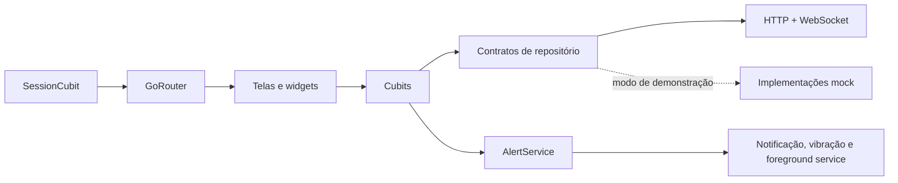
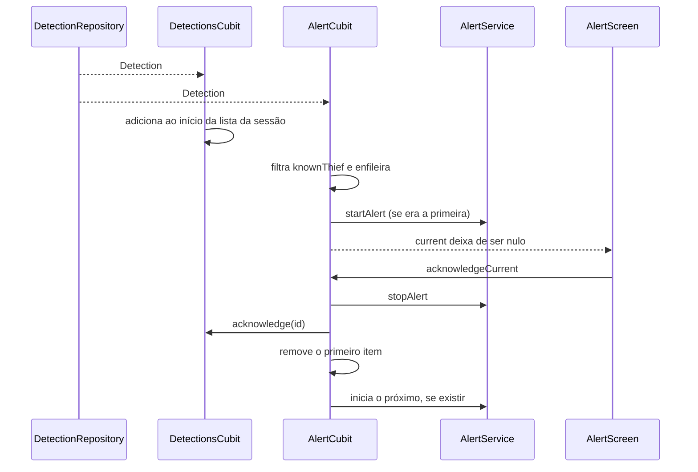

# Arquitetura

## Visão geral

O Sentinela usa uma organização por funcionalidades (`features`) e separa
interface, estado e acesso a dados. Os widgets não acessam rede ou persistência
diretamente; eles interagem com Cubits, que dependem de contratos de
repositório. Em produção, esses contratos recebem implementações HTTP e
WebSocket; os mocks permanecem disponíveis para demonstração.

## Composição da aplicação

`main.dart` garante a inicialização do Flutter, prepara o `AlertService` e cria
o `App`. Em `App.initState`, as dependências de longa duração são instanciadas:

- `ConnectionRepository` → `RemoteConnectionRepository`;
- `DetectionRepository` → `RemoteDetectionRepository`;
- `SessionCubit`, `DetectionsCubit` e `AlertCubit`;
- `GoRouter`, atualizado quando o estado da sessão muda.

As instâncias são disponibilizadas com `RepositoryProvider` e
`MultiBlocProvider` e encerradas no `dispose` do `App`.

## Camadas e responsabilidades

### Apresentação

As pastas `view/` contêm telas e widgets. Elas renderizam o estado dos Cubits e
encaminham ações do usuário, como conectar, filtrar, atualizar, desconectar e
confirmar um alerta.

Rotas disponíveis:

| Rota | Tela | Regra |
| --- | --- | --- |
| `/login` | `LoginScreen` | entrada sem sessão |
| `/home` | `DetectionsListScreen` | exige sessão |
| `/detection/:id` | `DetectionDetailScreen` | exige sessão |
| `/alert` | `AlertScreen` | exige sessão e não pode ser fechada manualmente |

O redirecionamento global leva usuários sem sessão ao login e usuários já
conectados da tela de login para a listagem.

### Estado

- `LoginCubit`: valida o formulário, executa a autenticação e controla o
  armazenamento da última conexão.
- `SessionCubit`: é a fonte de verdade da sessão atual.
- `DetectionsCubit`: aplica filtros, recebe eventos em tempo real, mantém a
  lista da sessão atual e registra confirmações locais.
- `AlertCubit`: observa a mesma stream, seleciona apenas `knownThief` e mantém
  uma fila de alertas críticos.

O `AppEffects`, em `app.dart`, coordena efeitos que atravessam funcionalidades:
início e fim do stream, foreground service, limpeza de
alertas e navegação automática para a tela crítica.

### Dados

`ConnectionRepository` define conexão e desconexão. A implementação remota
autentica em `/api/v1/sessions`, mantém o token apenas em memória e tenta
invalidá-lo ao desconectar.

`DetectionRepository` define:

- stream broadcast de novas detecções;
- início e pausa do tempo real;
- descarte dos recursos.

`RemoteDetectionRepository` baixa fotos sob demanda e mantém o WebSocket com
ticket de uso único, deduplicação e reconexão
progressiva. `MockDetectionRepository` continua disponível com
`--dart-define=USE_MOCKS=true`.

### Serviços de plataforma

`SecureStorageService` persiste somente IP, porta e usuário. O serviço usa
`flutter_secure_storage`, delegando a proteção ao armazenamento nativo.

`AlertService` encapsula plugins nativos. No Android e iOS ele configura
notificações e vibração; no Android também inicia um foreground service. Nas
outras plataformas seus métodos de alerta são operações vazias, permitindo
testar a interface sem chamadas nativas incompatíveis.

## Ciclo de uma detecção crítica

Como `alertsStream` é broadcast, a listagem e o sistema de alertas recebem o
mesmo evento independentemente.

## Modelos principais

- `ConnectionConfig`: IP, porta, usuário e endereço derivado.
- `Detection`: código público, classificação, horário, câmera, ocorrências,
  foto opcional e confirmação local.
- `Occurrence`: data, local e descrição de uma ocorrência anterior.
- `DetectionStatus`: `knownThief`, `suspect` ou `newPerson`, incluindo
  representação visual.

## Decisões e invariantes

- Não existe sessão persistente; abrir o app sempre começa desconectado.
- A senha não é incluída em `ConnectionConfig` nem gravada no dispositivo.
- Apenas `knownThief` dispara alerta crítico.
- Um único alerta toca por vez; os demais aguardam em ordem de chegada.
- A tela de alerta bloqueia o gesto/botão voltar.
- Desconectar cancela o tempo real e qualquer alerta em andamento.
- A confirmação é local e não altera o sistema principal.
- `startRealtime` é idempotente para evitar timers/conexões duplicados.

## Estratégia de testes

Os testes unitários cobrem validação, sucesso e falha no login, carregamento e
filtro de detecções, recepção do stream, confirmação local e comportamento da
fila de alertas. O teste de widget confirma que uma inicialização sem sessão
abre o login.

Ao implementar repositórios reais, mantenha testes de contrato para garantir
que ordenação, tipos de erro, lifecycle do stream e fechamento de recursos
continuem equivalentes aos mocks.
